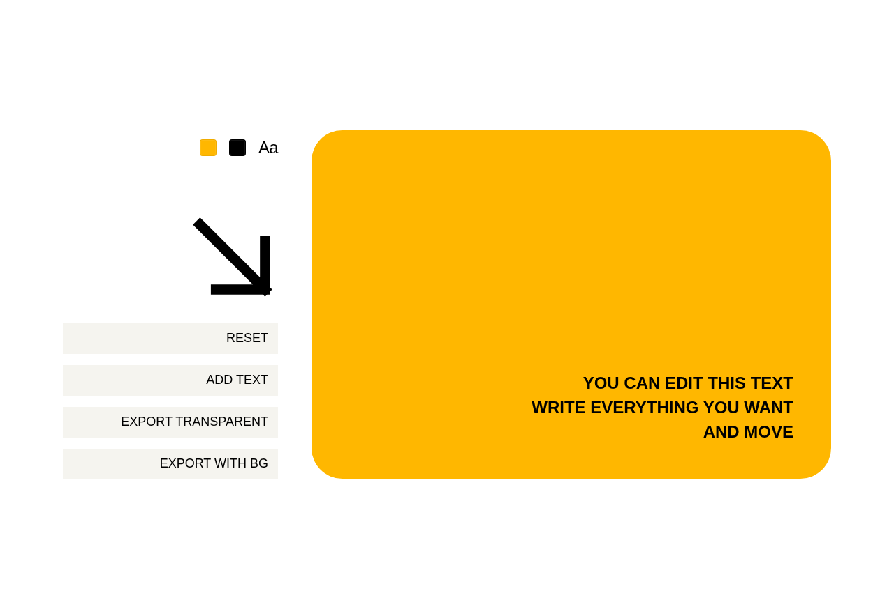
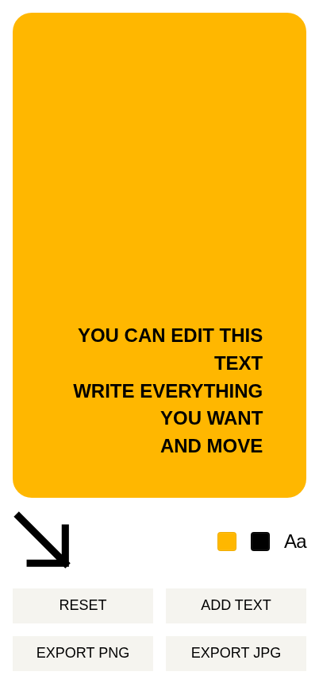

# MPRO Text Canvas

> An interactive, exportable text-composition canvas for Elementor — part of the MPRO plugin suite for WordPress.

[](https://github.com/moghadam-pro/text-canvas-wp-plugin/releases)
[](https://wordpress.org)
[](https://php.net)
[](https://elementor.com)
[](LICENSE)

---

## Overview

**MPRO Text Canvas** adds a responsive text-design workspace to Elementor. Visitors can click or tap text directly on the canvas to edit it, drag layers to reposition them, resize text with a handle or a two-finger pinch gesture, choose fonts and colors, and download the finished composition as an image.

The widget follows the supplied desktop and mobile layouts:

- It always fills the width of the Elementor container that contains it.
- The default canvas height is **500 px on desktop/tablet** and **610 px on mobile**.
- Desktop uses a left control panel and right canvas.
- Mobile places the canvas first, followed by the compact toolbar and two-column action grid.
- Export dimensions are exactly the rendered canvas dimensions.
- Exported images are always rectangular; the visual corner radius is intentionally excluded.

---

## Preview

### Desktop



### Mobile



---

## Main Features

### Visitor-facing canvas

- **Inline editing** — click or tap a text layer to enter editing mode.
- **Exit editing naturally** — click or tap anywhere outside the active layer.
- **Drag positioning** — move each text layer freely inside the canvas.
- **Pinch-to-resize** — use two fingers on touch devices to resize text.
- **Visible resize handle** — mouse and keyboard users can resize the selected layer.
- **Up to three text layers** — the Add Text action disables automatically at the limit.
- **Layer deletion** — use the selected-layer delete control or the Delete/Backspace key.
- **Plain-text paste** — pasted formatting is stripped to keep output predictable.
- **RTL/LTR friendly** — editable text uses automatic text direction detection.
- **Responsive starting positions** — separate desktop, tablet, and mobile defaults.

### Toolbar

- **Background color swatch** opens a color-picker modal.
- **Text color swatch** changes the selected layer color.
- **Aa font control** opens the configured font library.
- **Reset** restores all text layers, colors, font choices, sizes, and positions to widget defaults.
- **Add Text** creates another editable layer using the default text and style.
- **Export Transparent / Export PNG** downloads a transparent PNG.
- **Export With BG / Export JPG** downloads a JPG with the current canvas background.

### Image export

- Uses the browser Canvas API; no server processing is required.
- Waits for configured fonts to finish loading before rendering.
- Preserves text alignment, line height, wrapping, weight, style, direction, color, and letter spacing.
- Uses the exact current CSS pixel dimensions of the yellow frame.
- Transparent export contains no background pixels.
- Background export fills the complete rectangle, including the four corners.
- Border radius is never baked into either export.
- Files are saved locally with timestamped names.

### WordPress administration

Available under **MPRO → Text Canvas**:

- Default text
- Default background color
- Default text color
- Default font stack
- Google Fonts management
- Uploaded font management

### Font management

#### Google Fonts

- Add any Google Fonts family by name.
- A built-in suggestion list includes commonly used Latin, Arabic, and Persian families.
- Select one or more weights, for example `400;700`.
- Fonts use `display=swap`.
- Google Fonts are registered as a widget stylesheet dependency and are loaded only when the Text Canvas stylesheet is used.

#### Uploaded fonts

- Upload through the standard WordPress Media Library.
- Supported formats: WOFF2, WOFF, TTF, and OTF.
- Configure family name, weight, style, and format per file.
- Generated `@font-face` declarations use `font-display: swap`.

### Site color integration

- Elementor color controls retain access to Elementor Global Colors.
- The visitor-facing color picker also includes the active Elementor Kit's system and custom color palette.
- Plugin defaults, white, and black are always available as presets.

---

## Installation

### From the release ZIP

1. Download `mpro-text-canvas.zip` from the repository's **Releases** page.
2. Open **WordPress Admin → Plugins → Add New → Upload Plugin**.
3. Choose the ZIP file and click **Install Now**.
4. Activate **MPRO Text Canvas**.
5. Confirm that Elementor is installed and active.

### From source

```bash
cd wp-content/plugins/
git clone https://github.com/moghadam-pro/text-canvas-wp-plugin.git mpro-text-canvas
```

Then activate the plugin from **Plugins → Installed Plugins**.

---

## Initial Setup

1. Go to **MPRO → Text Canvas**.
2. Set the global default text and colors.
3. Add any Google Fonts or uploaded font files needed on the site.
4. Save changes.
5. Edit a page with Elementor.
6. Find **MPRO Text Canvas** in the **MPRO** widget category.
7. Drag the widget into any container.

---

## Elementor Controls

### Content

| Control | Purpose |
| --- | --- |
| Default text | Text used by the initial layer and every newly added layer |
| Reset label | Label shown on the reset action |
| Add Text label | Label shown on the add-layer action |
| Transparent export labels | Separate desktop and mobile labels |
| Background export labels | Separate desktop and mobile labels |

### Canvas

| Control | Responsive | Default |
| --- | --- | --- |
| Background color | No | Admin default (`#ffb700`) |
| Height | Yes | 500 px desktop/tablet, 610 px mobile |
| Corner radius | Yes | 44 px desktop, 24 px mobile |
| Inner padding | Yes | 32 px desktop, 20 px mobile |

### Default text style

| Control | Responsive | Default |
| --- | --- | --- |
| Text color | No | Admin default |
| Font family | No | Admin default font stack |
| Font weight | No | 700 |
| Font size | Yes | 24 px |
| Line height | Yes | 1.45 em |
| Alignment | No | Right |
| Initial horizontal position | Yes | 68% desktop, 52% mobile |
| Initial vertical position | Yes | 84% desktop, 80% mobile |
| Initial text width | Yes | 59% desktop, 78% mobile |

### Toolbar and layout

| Control | Responsive | Default |
| --- | --- | --- |
| Desktop toolbar width | Yes | 308 px |
| Layout gap | Yes | 48 px desktop, 16 px mobile |
| Button background | No | `#f5f4ef` |
| Button text color | No | Black |
| Button radius | Yes | 4 px |

---

## Visitor Interaction Guide

| Action | Mouse / keyboard | Touch |
| --- | --- | --- |
| Select and edit text | Click a layer | Tap a layer |
| Finish editing | Click outside | Tap outside |
| Move text | Drag layer | Drag layer |
| Resize text | Drag resize handle; arrow keys on focused handle | Two-finger pinch or drag handle |
| Delete text | Delete button or Delete/Backspace | Delete button |
| Change font | Select layer, then click Aa | Select layer, then tap Aa |
| Change text color | Select layer, then click text swatch | Select layer, then tap text swatch |

---

## Export Behavior

### Transparent PNG

Desktop label: **EXPORT TRANSPARENT**  
Mobile label: **EXPORT PNG**

The PNG contains only the text layers. Empty canvas pixels remain transparent.

### JPG with background

Desktop label: **EXPORT WITH BG**  
Mobile label: **EXPORT JPG**

The JPG contains the current background color across the complete rectangular image.

### Dimensions

The plugin reads the live frame dimensions immediately before export. Examples using the default design:

- Desktop: `744 × 500 px` when placed in the supplied `1100 px` composition.
- Mobile: `370 × 610 px` in a `370 px` wide container.

A different Elementor container width produces a correspondingly different export width. The configured frame height remains in effect.

---

## File Structure

```text
mpro-text-canvas/
├── mpro-text-canvas.php
├── uninstall.php
├── README.md
├── readme.txt
├── CHANGELOG.md
├── RELEASE-NOTES.md
├── LICENSE
├── includes/
│   ├── class-mpro-tc-admin.php
│   ├── class-mpro-tc-elementor-widget.php
│   └── class-mpro-tc-fonts.php
├── assets/
│   ├── css/
│   │   ├── admin.css
│   │   └── frontend.css
│   └── js/
│       ├── admin.js
│       └── frontend.js
├── docs/
│   ├── desktop-preview.png
│   └── mobile-preview.png
├── scripts/
│   └── build-release.sh
├── tests/
│   ├── browser-fixture.html
│   ├── run-browser-smoke.sh
│   └── run_browser_smoke.py
└── .github/workflows/
    ├── ci.yml
    └── release.yml
```

---

## Technical Architecture

### PHP

- Registers the shared MPRO admin menu and plugin settings.
- Registers frontend assets without globally enqueueing the widget bundle.
- Registers the Elementor widget through `elementor/widgets/register`.
- Exposes Elementor Kit colors to the frontend picker.
- Registers Google Fonts as optional stylesheet dependencies.
- Generates safe `@font-face` declarations for uploaded files.

### JavaScript

The frontend is written in dependency-free vanilla JavaScript.

Each widget instance owns:

- Its own frame and layer state
- Pointer tracking and gesture state
- Selection and editing state
- Modal state
- Export rendering

Multiple Text Canvas widgets can therefore exist on the same page without sharing layer state.

### CSS

- CSS Grid reproduces the desktop and mobile compositions.
- Elementor selectors and CSS custom properties handle visual overrides.
- The frame is always `width: 100%` of its available grid column.
- Touch interaction uses Pointer Events and `touch-action` rules.

---

## Development

### Static checks

```bash
find . -name '*.php' -not -path './vendor/*' -print0 | xargs -0 -n1 php -l
node --check assets/js/frontend.js
node --check assets/js/admin.js
```

### Browser smoke test

The browser test verifies:

- Widget initialization
- Desktop and mobile frame dimensions
- Tap-to-edit and tap-outside behavior
- Drag movement
- Two-pointer pinch resizing
- Three-layer limit
- Reset behavior
- Font and color modals
- PNG and JPG generation
- Exact export dimensions
- Transparent PNG corners
- Full rectangular JPG background with no exported radius

Run:

```bash
./tests/run-browser-smoke.sh
```

The test requires Python 3, Chromium, Xvfb, `requests`, and `websocket-client`.

### Build the installable ZIP

```bash
./scripts/build-release.sh
```

Output:

```text
dist/mpro-text-canvas.zip
```

---

## Automated Release

The workflow in `.github/workflows/release.yml` watches `.release-trigger`.

To publish a new version:

1. Update the plugin version and changelog.
2. Put the tag name in `.release-trigger`, for example `v1.1.0`.
3. Commit and push the trigger file.
4. GitHub Actions runs syntax checks, builds the ZIP, creates the tag/release if needed, and uploads the package.

---

## Requirements

| Dependency | Minimum |
| --- | --- |
| WordPress | 5.8 |
| PHP | 7.4 |
| Elementor | 3.0 recommended |
| Browser | Modern browser with Pointer Events, Canvas, and download support |

Elementor is required for rendering the widget. The administration page remains accessible when Elementor is inactive, and WordPress displays an activation notice.

---

## Privacy and External Requests

- The canvas and exports are processed entirely in the visitor's browser.
- No composition text or image is sent to the WordPress server by the plugin.
- No analytics or tracking are included.
- Google Fonts requests occur only after an administrator explicitly adds a Google Fonts family.
- Uploaded fonts are served from the site's own Media Library.

---

## Known Scope of v1.0.0

- Text layers are intentionally limited to three.
- Pinch gestures resize text but do not rotate it.
- The exporter supports text and solid background colors; image backgrounds are not part of v1.0.0.
- User compositions are not persisted between page visits.
- Export resolution follows CSS pixels rather than applying an automatic high-density multiplier.

---

## MPRO Suite

MPRO Text Canvas is designed to coexist with the other MPRO WordPress plugins. The suite shares one **MPRO** top-level admin menu and gives every plugin its own submenu.

| Plugin | Purpose |
| --- | --- |
| **Text Canvas** | Interactive text composition and image export |
| [Text Scramble](https://github.com/moghadam-pro/text-scramble-wp-plugin) | Character decode animation for text, links, and buttons |
| [Portfolio](https://github.com/moghadam-pro/portfolio-wp-plugin) | Custom portfolio content management and presentation |

---

## Changelog

See [CHANGELOG.md](CHANGELOG.md).

---

## Author

**Sayid Moghadam / Moghadam.pro**  
[https://moghadam.pro/mpro-plugins](https://moghadam.pro/mpro-plugins)

---

## License

MPRO Text Canvas is licensed under the GNU General Public License v2.0 or later. See [LICENSE](LICENSE).
